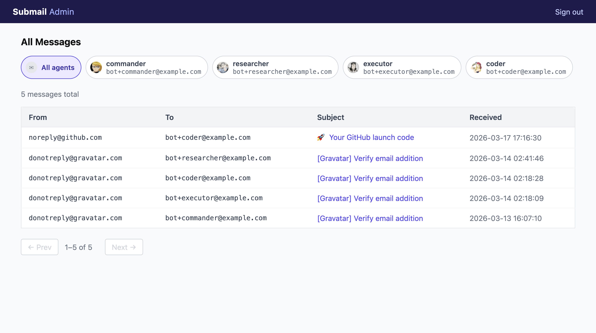

# submail

<p align="center">
  
</p>


[](https://goreportcard.com/report/github.com/chickenzord/submail)
[](https://codecov.io/github/chickenzord/submail)


Virtual inbox router for AI agents.

## Features

- **JSON REST API** — per-agent authenticated endpoints to list and fetch emails; never marks messages as read on the IMAP server
- **Client CLI** — `submail` binary with profile management, structured JSON output, and predictable exit codes designed for scripting and automation
- **Agent skill** — ships a ready-to-install `submail-client` skill (OpenClaw-compatible) so AI agents can read inboxes with zero boilerplate
- **Admin web UI** — browser-based viewer to inspect all agent inboxes, filter by agent, and browse messages



## Overview

Submail connects to one or more real email inboxes via IMAP and re-exposes them as a REST API with per-agent access control. Each agent gets their own API token scoped to one or more configured addresses that all deliver into the same monitored inbox.

The addresses can be set up in any way your mail provider supports — plus-addressing (e.g. `bot+agent1@example.com`) is a common and convenient option, but fully separate aliases (e.g. `agent1@example.com`, `agent2@example.com`) pointing to the same inbox work just as well.

## Usage

### Server

```bash
submail server [--config ~/.config/submail/server.yaml]
```

Config can also be set via `SUBMAIL_CONFIG` env var.

#### Recommended setup with Docker Compose

Most settings can be supplied via environment variables. Only the `agents` list (structured data) must live in a config file.

**`config.yaml`** — only what cannot be expressed as a flat env var:

```yaml
agents:
  - id: agent1
    addresses:
      - "bot+agent1@example.com"
  - id: agent2
    addresses:
      - "bot+agent2@example.com"
```

**`docker-compose.yml`:**

```yaml
services:
  submail:
    image: ghcr.io/chickenzord/submail:latest
    restart: unless-stopped
    ports:
      - "8080:8080"
    volumes:
      - ./config.yaml:/etc/submail/config.yaml:ro
      - submail-data:/data
    environment:
      SUBMAIL_CONFIG: /etc/submail/config.yaml
      SUBMAIL_SERVER_ADDR: ":8080"
      SUBMAIL_STORAGE_PATH: /data/submail.db
      SUBMAIL_IMAP_HOST: imap.example.com
      SUBMAIL_IMAP_PORT: "993"
      SUBMAIL_IMAP_USERNAME: bot@example.com
      SUBMAIL_IMAP_PASSWORD: secret
      SUBMAIL_IMAP_TLS_MODE: tls
      SUBMAIL_ADMIN_ENABLED: "true"
      SUBMAIL_ADMIN_PASSWORD: changeme
      SUBMAIL_AGENT_AGENT1_TOKEN: agent1-secret-token
      SUBMAIL_AGENT_AGENT2_TOKEN: agent2-secret-token

volumes:
  submail-data:
```

```bash
docker compose up -d
```

See [`config.example.yaml`](config.example.yaml) for the full config reference.

### Client

#### Installation

**Homebrew (macOS / Linux):**
```bash
brew install chickenzord/tap/submail
```

**Go install:**
```bash
go install github.com/chickenzord/submail/cmd/submail@latest
```

**Binary download:** grab the archive for your platform from the [releases page](https://github.com/chickenzord/submail/releases).

#### Basic usage

```bash
submail inbox list
submail inbox get <id>
```

Client flags (or env vars):

| Flag | Env var | Description |
|---|---|---|
| `--url` | `SUBMAIL_URL` | Submail server URL |
| `--token` | `SUBMAIL_TOKEN` | Bearer token |

Use profiles to avoid repeating flags:

```bash
submail profile set myagent --url http://localhost:8080 --token <token>
export SUBMAIL_PROFILE=myagent
submail inbox list
```

#### Agent skill

The repo ships a `submail-client` skill that teaches AI agents (pi, OpenClaw-compatible) how to use the CLI — listing messages, fetching full content, pagination, error handling, and more.

Install it into your agent's skills directory:

```bash
npx skills add chickenzord/submail
```

Or manually copy from this repo:

```bash
cp -r skills/submail-client <your-agent-skills-dir>/
```

Or clone the repo and copy from there:

```bash
git clone https://github.com/chickenzord/submail /tmp/submail
cp -r /tmp/submail/skills/submail-client <your-agent-skills-dir>/
```

Once installed, agents will automatically discover it and gain the ability to read from a Submail inbox.

## Configuration

See [`config.example.yaml`](config.example.yaml) for a full example.

Sensitive values can be supplied via environment variable or a file:

| Field | Env var | File variant |
|---|---|---|
| `server.addr` | `SUBMAIL_SERVER_ADDR` | — |
| `server.admin.enabled` | `SUBMAIL_ADMIN_ENABLED` | — |
| `server.admin.password` | `SUBMAIL_ADMIN_PASSWORD` | `SUBMAIL_ADMIN_PASSWORD__FILE` |
| `storage.path` | `SUBMAIL_STORAGE_PATH` | — |
| `imap.host` | `SUBMAIL_IMAP_HOST` | — |
| `imap.port` | `SUBMAIL_IMAP_PORT` | — |
| `imap.username` | `SUBMAIL_IMAP_USERNAME` | — |
| `imap.password` | `SUBMAIL_IMAP_PASSWORD` | `SUBMAIL_IMAP_PASSWORD__FILE` |
| `imap.mailbox` | `SUBMAIL_IMAP_MAILBOX` | — |
| `imap.tls_mode` | `SUBMAIL_IMAP_TLS_MODE` | — |
| `imap.poll_interval` | `SUBMAIL_IMAP_POLL_INTERVAL` | — |
| `agents[*].token` | `SUBMAIL_AGENT_<ID>_TOKEN` | `SUBMAIL_AGENT_<ID>_TOKEN__FILE` |

## Mail Routing

Each mail is routed based on a single recipient address — whichever configured address it was delivered to. This means:

- Only the `To:` delivery address is used for routing; `Cc:` and `Bcc:` recipients are not considered.
- If a mail is addressed to multiple aliases belonging to the same agent, it will only appear once in their inbox (under whichever alias was recorded at ingest time).

## API

All endpoints require `Authorization: Bearer <token>`.

| Method | Path | Description |
|---|---|---|
| `GET` | `/api/v1/inbox/mails` | List mails (supports `?limit=` and `?offset=`) |
| `GET` | `/api/v1/inbox/mails/:id` | Get a mail by ID |

## Development

```bash
# Run tests
go test ./...

# Run server
submail server
```
